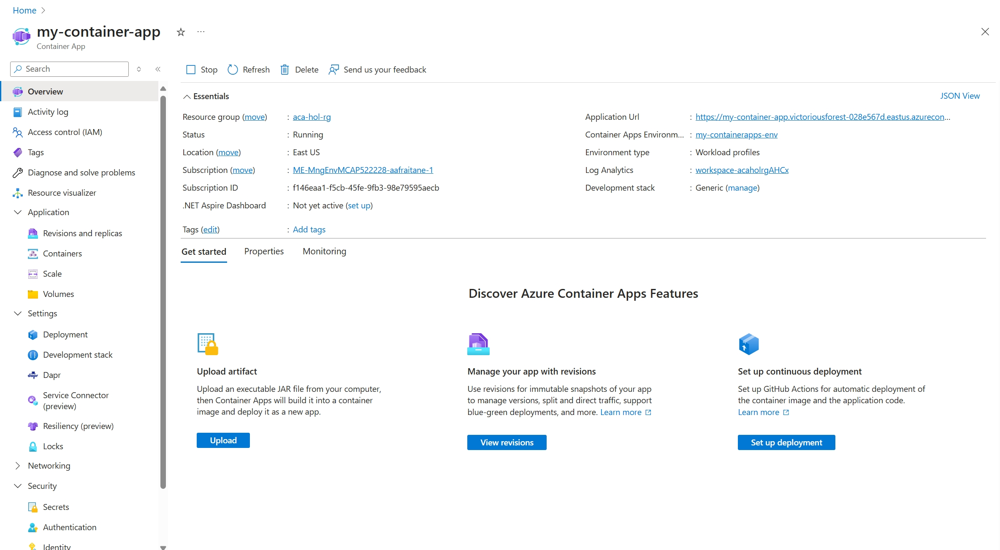
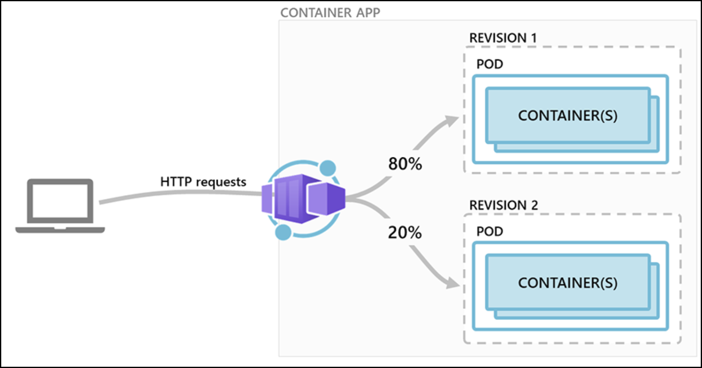
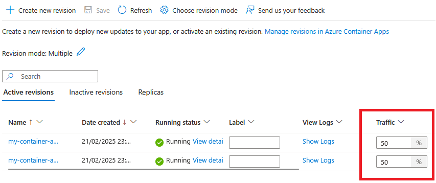
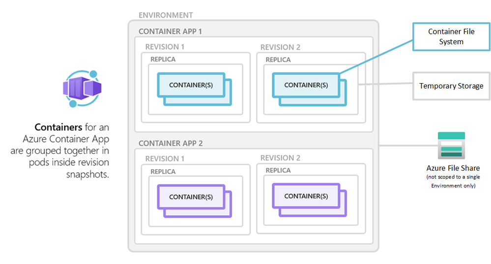
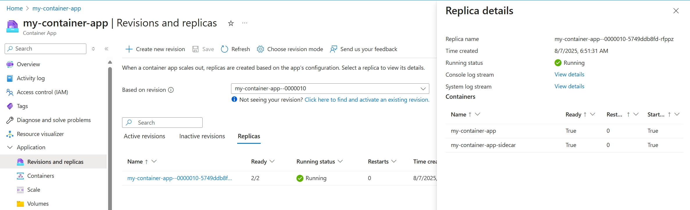
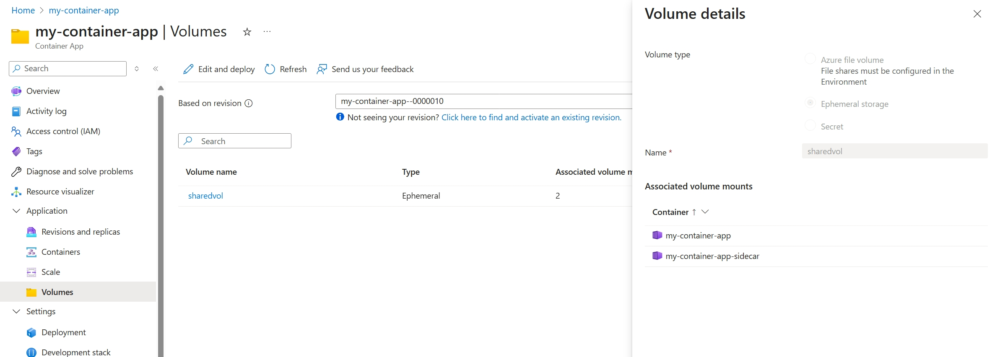

# Azure Container Apps beginners Lab

In this lab, you will **build, deploy, and explore an application using Azure Container Apps**. 

Azure Container Apps is a managed **serverless container platform** that abstracts away infrastructure management, allowing you to run containerized applications without worrying about Kubernetes or servers. 

Common scenarios for Container Apps include deploying web APIs, hosting background jobs, and running event-driven microservices, with built-in automatic scaling (including scale to zero) capabilities.

**Lab Overview:** By the end of this lab, you will have:

- Created a containerized web application and built a Docker image locally.
- Pushed the Docker image to **Azure Container Registry (ACR)**, Azure's private container image registry.
- Deployed the container image to **Azure Container Apps** and accessed it via a public endpoint.
- Explored different image deployment ("download") strategies, such as using registry credentials vs. managed identities for pulling images.
- Explored different hosting options in Container Apps (external vs. internal ingress, and disabling ingress).
- Configured advanced features:
  - **Ingress Traffic Splitting:** Gradually shift traffic between two versions of your app for blue-green deployments (canary releases).
  - **Network IP Restrictions:** Limit access to your app by client IP address ranges.
  - **Data persistence** options in Azure Container Apps, including ephemeral storage, replica-scoped volumes, and durable Azure Files shares.
Throughout the lab, we will use Azure CLI commands (with the Azure CLI extension for Container Apps) and guidance from official Microsoft Learn resources.

> **Note:** All commands in this guide are shown for Bash (Linux/macOS) or PowerShell. Ensure you have the Azure CLI installed and updated, Docker running, and an active Azure subscription. Examples will use placeholder names—replace them with your own where appropriate (e.g., resource group name, registry name, etc.).

## Prerequisites

Before you begin, make sure you have the following:

- **Azure Subscription:** Access to an Azure subscription with permission to create resources.
- **Azure CLI:** Installed on your machine. Confirm by running `az --version`. If needed, install from the [Azure CLI installation guide](https://learn.microsoft.com/cli/azure/install)
- **Azure Container Apps CLI Extension:** Install or update the Azure Container Apps extension, which provides the `az containerapp` commands:

    ```bash
    az extension add --name containerapp --upgrade
    ```

  *(If you see errors about unrecognized commands, the extension may be missing or outdated.)*
- **Docker:** Installed and running on your local machine. Confirm by running `docker --version`. Docker is required to build and test the container image locally.
- **Code Editor:** (Optional) Visual Studio Code or another editor for editing application files.

## 1. Setup Azure Resources

First, set up the Azure resources needed for the lab.

### 1.1 Login and Provider Registration

Log in to Azure and ensure the Container Apps resource providers are enabled in your subscription.

```bash
# Log in to Azure CLI (this will open a browser for authentication)
az login

# (Optional) Ensure relevant Azure resource providers are registered
az provider register --namespace Microsoft.App
az provider register --namespace Microsoft.OperationalInsights
```

After login, Azure CLI will use your credentials for subsequent commands.

### 1.2 Create a Resource Group

Create a new **Resource Group** to organize all resources for this lab. Replace **MY_RESOURCE_GROUP** with a name of your choice and **MY_REGION** with an Azure region that supports Container Apps (e.g., `westeurope`, `eastus`, etc.).

```bash
RESOURCE_GROUP="MY_RESOURCE_GROUP"
LOCATION="MY_REGION"

az group create --name $RESOURCE_GROUP --location $LOCATION
```

This command creates a resource group where all your resources (registry, Container Apps environment, etc.) will reside.

### 1.3 Create an Azure Container Registry (ACR)

Next, create an Azure Container Registry to store your container images. Azure Container Registry is a private registry for your Docker images (similar to Docker Hub, but hosted in Azure). We will push our app’s image here and later deploy it from the registry.
Choose a unique name for your registry (all lowercase, no spaces; e.g., your initials + "acr"). Set the registry name and create it using the **Basic SKU** (sufficient for this exercise):

```bash
ACR_NAME="myacrlab$RANDOM"  # choose a unique name; $RANDOM appends a random number
az acr create --name $ACR_NAME --resource-group $RESOURCE_GROUP --location $LOCATION --sku Basic
```

> **Note:** The registry name must be globally unique within Azure and will form part of its login URL (`<ACR_NAME>.azurecr.io`). The Basic SKU is a cost-effective option for demos and testing.

When the command completes, it outputs JSON or a summary. Take note of the `"loginServer"` in the output (it will be `<ACR_NAME>.azurecr.io`). We will use that to tag and push images.

### 1.4 Create an Azure Container Apps Environment

An **Azure Container Apps Environment** provides isolation and optional networking for one or more container apps. Think of it as a secure context (similar to a Kubernetes cluster, but fully managed). Create an environment now:

```bash
ENV_NAME="my-containerapps-env"
az containerapp env create --name $ENV_NAME --resource-group $RESOURCE_GROUP --location $LOCATION
```

This sets up the environment where the Container App will run. You can host multiple apps in one environment, sharing features like networking settings or log analytics. We will use a single environment for simplicity.

*(If prompted to set up a Log Analytics workspace, the CLI might create one automatically to enable logging.)*

## 2. Build a Docker Image Locally

Now let's create a simple web application, containerize it with Docker, and test it locally. The app will be minimal — just a static web page served by **Nginx** (a lightweight web server). This keeps our focus on containers and Azure rather than complex app code.

### 2.1 Create the Application Content

Choose or create a local directory for the project (e.g., `aca-lab`). Within that directory, create an `index.html` file with some content:

```html
<!DOCTYPE html>
<html>
  <head>
    <meta charset="UTF-8" />
    <title>Azure Container Apps - Demo</title>
  </head>
  <body>
    <h1>Hello from Azure Container Apps!</h1>
    <p>This is a sample app running in Azure Container Apps.</p>
  </body>
</html>
```

This simple HTML page will be served by our container.

### 2.2 Create a Dockerfile

In the same directory, create a file named `Dockerfile` (no extension) with the following content:

```Dockerfile
# Use the official Nginx image as the base image
FROM nginx:alpine

# Copy the static HTML page to Nginx's default static content directory
COPY index.html /usr/share/nginx/html/index.html
```

**Explanation:**

- We use a small Nginx image (based on Alpine Linux) as the base image.
- We copy our `index.html` into Nginx's web content directory. When a container starts from this image, Nginx will serve this page on port 80 by default.

### 2.3 Build the Docker Image

Make sure Docker is running, then build the image using the Docker CLI. In a terminal at the project directory (where the Dockerfile is), run:

```bash
# Build the Docker image and tag it as "mycontainerapp:v1"
docker build -t mycontainerapp:v1 .
```

This builds an image tagged `mycontainerapp:v1` using the Dockerfile in the current directory (`.`). The tag `v1` designates this as version 1 of our app.

You should see Docker pulling the Nginx base image (if not already cached) and adding the `index.html` into the image. Once completed, run `docker images` to verify the image exists.

### 2.4 Test the Container Locally (Optional)

Let's verify the image works by running a container locally:

```bash
docker run -d -p 8080:80 mycontainerapp:v1
```

- The `-d` flag runs the container in detached mode (in the background).
- `-p 8080:80` maps port 8080 on your host machine to port 80 in the container (where Nginx is serving the content).

After running this, open a web browser to **<http://localhost:8080>**. You should see the "Hello from Azure Container Apps!" page served by Nginx from inside the container. This confirms our container image is functioning as expected.

When done, stop the container:

```bash
docker stop $(docker ps -q --filter ancestor=mycontainerapp:v1)
```

This command stops the running container (it finds the container ID using the image name filter, then stops it).

## 3. Push the Image to Azure Container Registry

Now that our image works locally, we need to push it to Azure Container Registry (ACR) so that Azure Container Apps can pull it from the cloud.

ACR is a private registry for your images. Pushing an image involves:

1. Tagging the image with the registry's address.
2. Using `docker push` to upload it.

### 3.1 Log in to ACR from Docker/CLI

First, authenticate your local Docker client to your ACR. Azure CLI provides a convenient command for this:

```bash
az acr login --name $ACR_NAME
```

This command logs Docker into your registry by fetching an Azure AD token under the hood. If successful, you'll see "Login Succeeded".

*(If this command fails, make sure you're logged in with `az login` and double-check the ACR name. You can also fall back to using the ACR's admin username and password, but that method is less secure.)*

### 3.2 Tag the Image with the ACR Repository Name

Docker uses tags to decide where an image will be pushed. We need to tag `mycontainerapp:v1` with the ACR's login server so Docker knows to push it there.

Retrieve the login server name (which is `<ACR_NAME>.azurecr.io`):

```bash
ACR_LOGIN_SERVER=$(az acr show -n $ACR_NAME --query "loginServer" -o tsv)
```

Now tag the image to point to the ACR:

```bash
docker tag mycontainerapp:v1 $ACR_LOGIN_SERVER/mycontainerapp:v1
```

This adds a new tag to the image, something like `myregistry.azurecr.io/mycontainerapp:v1`. Run `docker images` to verify the image now has that tag.

### 3.3 Push the Image to ACR

Push the tagged image to your Azure Container Registry:

```bash
docker push $ACR_LOGIN_SERVER/mycontainerapp:v1
```

Docker will upload the image layers to ACR. When the push is complete, your image is stored in the Azure cloud.

You can confirm by listing the repositories in your registry:

```bash
az acr repository list --name $ACR_NAME -o table
```

You should see `mycontainerapp` listed as a repository in your ACR. At this point, the container image is in a private registry in Azure (similar to how an image might be on Docker Hub, but private to you).

## 4. Deploy the Container to Azure Container Apps

With the image in ACR, it's time to deploy it to Azure Container Apps so it runs as a container instance in the cloud. We will create a Container App that uses our image and set it up with ingress (network access).

### 4.1 Create the Container App

Use the Azure CLI to create a container app instance from the image in ACR. We need to specify:

- The container app name (e.g., "my-container-app").
- The Container Apps environment name (from step 1.4).
- The container image (including the registry login server and tag).
- How to authenticate to the registry (credentials or managed identity).
- Ingress settings (we want external HTTP access on port 80).

Run the `az containerapp create` command:

```bash
APP_NAME="my-container-app"
az containerapp create \
  --name $APP_NAME \
  --resource-group $RESOURCE_GROUP \
  --environment $ENV_NAME \
  --image "$ACR_LOGIN_SERVER/mycontainerapp:v1" \
  --target-port 80 \
  --ingress external \
  --registry-server "$ACR_LOGIN_SERVER" \
  --registry-identity system
```

**Explanation:**

- `--image`: The full image name, including the tag, in our ACR.
- `--environment`: The Container Apps environment to deploy into.
- `--target-port 80`: The port our app listens on inside the container (Nginx uses 80). Azure's ingress will route traffic to this port.
- `--ingress external`: Enable ingress with an external endpoint (public URL).
- `--registry-server`: The ACR login server (e.g., `myacrlab123.azurecr.io`) where our image is hosted.
- `--registry-identity system`: Instructs Azure to use the container app's system-assigned managed identity to pull the image from ACR. This avoids having to pass the registry credentials in the command.

> **Note:** The first time you deploy from a private ACR using a managed identity, you may need to grant permissions. If the above command fails with an authentication error pulling the image, it means the container app's identity isn't yet authorized to access ACR. A quick workaround for the lab is to use ACR credentials instead:
>
> 1. Enable the admin user on the ACR: `az acr update -n $ACR_NAME --admin-enabled true`
> 2. Get the credentials:
>
>    ```bash
>    ACR_USER=$(az acr credential show -n $ACR_NAME --query "username" -o tsv)
>    ACR_PASS=$(az acr credential show -n $ACR_NAME --query "passwords[0].value" -o tsv)
>    ```
>
> 3. Re-run the `az containerapp create` command, replacing `--registry-identity system` with `--registry-username $ACR_USER --registry-password $ACR_PASS`.
>
> Using the managed identity (the default approach) is more secure, but using the admin credentials is simpler if you're having permission issues in a lab scenario. In a real environment, you would assign the **AcrPull** role to your container app's identity on the ACR resource to authorize it.

The creation might take a minute or two. If successful, it will output details of the deployed app (in JSON format). Key things to note:

- **`fqdn`**: This is the fully qualified domain name of your container app (e.g., `my-container-app.<region>.azurecontainerapps.io`). This is the public URL for your app.
- **`latestRevisionName`**: Name of the active revision (something like `my-container-app--abcde`).

You should be able to see the app in the Azure Portal under the Container Apps service, listed in your resource group.



### 4.2 Verify the Deployment

Once deployment is complete, retrieve the URL of your container app:

```bash
az containerapp show -n $APP_NAME -g $RESOURCE_GROUP --query "properties.configuration.ingress.fqdn" -o tsv
```

This should output the URL (for example, `my-container-app.lake.westeurope.azurecontainerapps.io`). Copy this and try accessing it in a web browser.

You should see the "Hello from Azure Container Apps!" page, which means your container is now running in Azure and accessible over the internet. 🎉

The Container Apps service automatically provides a secure HTTPS endpoint for your app. If you try the URL and it defaults to HTTPS, it should work. If you see a certificate warning or if the URL doesn't load, make sure you're using HTTPS (Azure Container Apps typically requires HTTPS for external ingress). You can also try prefixing with `https://` explicitly.

Congratulations, you have deployed a containerized application to Azure Container Apps!

## 5. Explore Image Deployment Strategies

Azure Container Apps supports pulling container images from **any OCI-compliant registry** (public or private). Let's discuss the different strategies for how Container Apps can retrieve your images (this is the "download strategies" part):

- **Using Registry Credentials (username/password):** This involves providing a username and password (or token) for the registry when deploying the container app. In our case, that would have been the ACR admin credentials or a service principal credentials for ACR. We could have used `--registry-username` and `--registry-password` in the `az containerapp create` command. This explicitly passes secrets for the pull.
- **Using Managed Identity:** This is the approach we attempted. By specifying `--registry-identity system`, we told Azure to use the container app's system-assigned managed identity to authenticate to ACR. This is more secure because you don't expose credentials in commands or configurations. The managed identity must have pull permissions (e.g., the AcrPull role) on the registry. Managed identities rely on Azure AD authentication rather than Docker-style username/password.
- **Public Registry (no auth):** If your image is in a public repository (for example, on Docker Hub or a public ACR repository), you don't need any authentication. You could have simply used `--image nginx:alpine` (for instance) and Azure Container Apps would pull it without credentials.

In this lab, our image was private, and we used a managed identity by default. If it worked, great; if not, we had the fallback to credentials.

**Key takeaways:**

- For private images, Azure Container Apps provides flexibility: use a managed identity (preferred for security) or provide credentials (useful for cross-tenant or quick setups).
- For public images, it's straightforward as no credentials are needed.
- Avoid using ACR's admin user in production. Instead, use Azure AD authentication (through managed identities or service principals) for pulling images.

## 6. Explore Hosting Options (Ingress Settings)

Azure Container Apps offers flexible ingress (network exposure) settings for your container app:

- **External Ingress (Public):** The app gets a public endpoint and is accessible from the internet.
- **Internal Ingress:** The app is only accessible within the Container Apps environment or a connected virtual network (no public internet access).
- **No Ingress:** The app has no externally reachable endpoint at all (used for background tasks or processing jobs).

We configured **External** ingress when creating the app (with `--ingress external`). Let's briefly explore what the other options mean and how to switch between them.

- **External Ingress:** A public URL is generated (as we saw). Azure handles routing and TLS (HTTPS) termination. This is used for web services, public HTTP APIs, etc.
- **Internal Ingress:** To use this, you could set `--ingress internal` when creating or updating the container app. In this mode, the app gets a hostname that is only resolvable inside the environment or virtual network. There's no internet-facing endpoint. This is useful for microservices that should only talk to each other or services that shouldn't be exposed publicly.
- **No Ingress:** If you disable ingress, the app will not listen on any endpoint for incoming requests. This can be done by not specifying `--ingress` at all or by explicitly disabling it via CLI (`az containerapp ingress disable ...`). This is ideal for jobs or event-driven processes that are triggered by events (like a queue message) rather than direct network calls.

**Activity – Try Changing Ingress (Optional):**
You can try toggling ingress settings on your deployed app using Azure CLI:

1. **Switch to Internal:**

    ```bash
    az containerapp ingress disable -n $APP_NAME -g $RESOURCE_GROUP
    az containerapp ingress enable -n $APP_NAME -g $RESOURCE_GROUP --type internal --target-port 80
    ```

   Now your app has internal ingress. If you check the app's FQDN again, you might see an internal address or nothing. The public URL from before will stop working (as expected).
2. **No Ingress:**

    ```bash
    az containerapp ingress disable -n $APP_NAME -g $RESOURCE_GROUP
    ```

   This removes ingress entirely. The app still runs, but it cannot receive external traffic.
3. **Restore External:**

    ```bash
    az containerapp ingress enable -n $APP_NAME -g $RESOURCE_GROUP --type external --target-port 80
    ```

   This brings back the public endpoint.

Keep in mind:

- Toggling between external/internal ingress does not create a new revision of your app; it just changes configuration.
- If you had an internal app and want to access it, you'd typically need to be inside the environment's virtual network or use another container app as a proxy.

For the rest of the lab, ensure your app has **external ingress** enabled so that you can easily access it from the internet.

## 7. Advanced Ingress: Traffic Splitting (Blue-Green Deployments)

Azure Container Apps supports revisions. Each deployment (image update, configuration change) creates a new *revision* (unless you opt to run in single-revision mode). By default, Container Apps is in single revision mode, meaning only one revision (the latest) is active at any time. If you enable multiple revision mode, you can have two or more revisions running concurrently and split incoming traffic between them.

This feature enables **blue-green** or **canary** deployments:

- **Blue-Green:** Deploy new version alongside old version (blue = old, green = new), but direct all traffic to old (blue) initially, then switch all traffic to new (green) at once when ready.
- **Canary:** Deploy new version and direct a small percentage of traffic to it (e.g., 5-10%) while the rest goes to the stable version. Monitor and increase the percentage if everything looks good.

Let's try a canary style deployment with our app to demonstrate traffic splitting.

### 7.1 Prepare a New Version of the App

Modify our `index.html` to clearly indicate a new version:

- Change the `<h1>` line to say **"Hello from Azure Container Apps - v2!"** (or similar).
- Save the file.

Build a new Docker image for version 2:

```bash
docker build -t mycontainerapp:v2 .
```

Tag and push this new image to ACR:

```bash
docker tag mycontainerapp:v2 $ACR_LOGIN_SERVER/mycontainerapp:v2
docker push $ACR_LOGIN_SERVER/mycontainerapp:v2
```

Now our registry has two images: version 1 (`mycontainerapp:v1`) and version 2 (`mycontainerapp:v2`).

### 7.2 Enable Multiple Revisions Mode

To have both versions running at once, we need to allow multiple revisions. Switch the app to multiple revision mode:

```bash
az containerapp revision set-mode --name $APP_NAME --resource-group $RESOURCE_GROUP --mode multiple
```

This changes the revision management mode to allow concurrency (it doesn't create a new revision by itself).

### 7.3 Deploy the New Revision

Update the container app to use the new image:

```bash
az containerapp update \
  --name $APP_NAME \
  --resource-group $RESOURCE_GROUP \
  --image "$ACR_LOGIN_SERVER/mycontainerapp:v2"
```

This will create a new revision of the app running the v2 image, while the old revision (v1) can remain active because we enabled multiple revision mode.

List the revisions to see their status:

```bash
az containerapp revision list -n $APP_NAME -g $RESOURCE_GROUP -o table
```

You should see something like:

```
Name                                        Active    Traffic
my-container-app--<rev1hash>    Yes       100% (default)
my-container-app--<rev2hash>    Yes       0%
```

By default, existing traffic stays on the prior revision (which has 100%) and the new one has 0% until we assign traffic to it.

*(In some cases, if the default traffic is set to go to "latest", it might automatically move to new revision. If that happened and the table shows 0% for old and 100% for new, don't worry — you can still adjust traffic weights as needed.)*

### 7.4 Split Traffic Between Revisions

Let's say we want to send 50% of traffic to the new version and keep 50% on the old version (to test v2 with half of the users).

The following diagram shows a container app with two revisions.


Use the ingress traffic splitting command:

```bash
# Replace <REVISION1_NAME> and <REVISION2_NAME> with actual revision names from the earlier list.
REV1=<old_revision_name>
REV2=<new_revision_name>

az containerapp ingress traffic set \
  --name $APP_NAME \
  --resource-group $RESOURCE_GROUP \
  --revision-weight $REV1=50 $REV2=50
```

This explicitly sets traffic weights for the two revisions. Now Azure's ingress will route 50% of incoming requests to each revision. (You can choose any percentage split as long as they total 100%. For example, 90/10, 80/20, etc.)

Verify the traffic split settings:

```bash
az containerapp show -n $APP_NAME -g $RESOURCE_GROUP --query "properties.configuration.ingress.traffic" -o json
```

You should see the two revisions each with weight 50 in the JSON output.



### 7.5 Validate the Traffic Split (Optional)

Test your app a few times to see both versions:

- Visit your app URL in the browser and refresh multiple times. You should sometimes see "v1" (the old message) and sometimes "v2". It might not alternate exactly one after the other due to how load balancing works, but roughly half your requests should go to v2.
- You could use a tool or script to send many requests and count how many responses contain "v2" vs "v1" to roughly confirm the 50/50 distribution.

This shows how you can gradually roll out a new version. If v2 has an issue, you could quickly set traffic back to 0 for v2 (and 100 for v1) to effectively rollback. If v2 looks good, you can increase to 100%.

For example, to move all traffic to v2:

```bash
az containerapp ingress traffic set -n $APP_NAME -g $RESOURCE_GROUP --revision-weight $REV1=0 $REV2=100
```

And optionally deactivate the old revision:

```bash
az containerapp revision deactivate -n $APP_NAME -g $RESOURCE_GROUP --revision $REV1
```

Deactivating a revision will scale it down to zero instances (it's not serving traffic anyway if you set it to 0%).

### 7.6 (Optional) Clean Up Revisions

If you're done with the traffic split test, you have a couple of choices:

- Keep both revisions running (with, say, all traffic on v2 and 0 on v1) in case you need to quickly switch back.
- Deactivate or delete the old revision if you are confident in the new version.
- Return to single revision mode to simplify management going forward:

    ```bash
    az containerapp revision set-mode -n $APP_NAME -g $RESOURCE_GROUP --mode single
    ```

  If you do this while two revisions are active, the platform will likely keep the one with 100% traffic and terminate the one with 0%. In single mode, future updates will replace the running revision instead of running side-by-side.

For the purposes of this lab, we'll assume the new version is working and proceed with it.

## 8. Advanced Networking: IP Restrictions

In some scenarios, even if your app has a public endpoint, you might want to restrict access to only certain IP addresses or ranges (for security or compliance). Azure Container Apps allows you to configure **IP ingress restrictions** on a container app with external ingress.

IP restriction works in two modes:

- **Allow mode:** Only specified IP addresses/ranges are allowed; everything else is blocked.
- **Deny mode:** Specified IP addresses/ranges are blocked; everything else is allowed.

Important points:

- By default (no rules), all IPs are allowed (typical open internet).
- You cannot mix allow and deny rules together—it's one approach or the other.

Let's walk through adding an IP allow list rule to restrict the app to only your IP.

### 8.1 Add an IP Allow Rule

Find out your current public IP address (the one you'll be accessing the app from). For example:

```bash
MY_IP=$(curl -s ifconfig.me)
echo $MY_IP
```

This should print your IP, e.g., `X.Y.Z.W`. For a single IP, you'll use CIDR notation with /32 to represent just that address.

Now add an ingress restriction rule to only allow this IP:

```bash
az containerapp ingress access-restriction set \
    --name $APP_NAME \
    --resource-group $RESOURCE_GROUP \
    --rule-name "AllowMyIP" \
    --description "Allow only my current IP" \
    --ip-address "${MY_IP}/32" \
    --action Allow
```

This creates a rule named "AllowMyIP" that permits traffic from `X.Y.Z.W/32` (your IP) and implicitly denies all other IPs.

List the rules to confirm:

```bash
az containerapp ingress access-restriction list -n $APP_NAME -g $RESOURCE_GROUP -o table
```

You should see your rule listed. It might also show that the mode is "Allow" with 1 rule, meaning only that IP is allowed.

### 8.2 Test the IP Restriction

Now try to access your app from a different IP (if possible):

- If you have access to another network (like using a VPN, or a proxy, or your phone's cellular network), attempt to load the app URL. It should be blocked (you might get a 403 Forbidden or it might just time out).
- Access the app from your allowed IP (your current network). It should still work fine.

This demonstrates that the app is now restricted to specific IP(s).

### 8.3 Remove or Adjust the Rule

To remove the restriction and open the app to all again:

```bash
az containerapp ingress access-restriction remove \
  --name $APP_NAME \
  --resource-group $RESOURCE_GROUP \
  --rule-name "AllowMyIP"
```

This removes that rule. If it was the only rule, your app goes back to no restrictions (open to all IPs).

Alternatively, if you needed to implement a deny list (block certain IPs but allow all others), you would:

- Remove all allow rules first (since allow and deny can't coexist).
- Add a rule with `--action Deny` and the IP/range to block.

For example, to block a single IP:

```bash
az containerapp ingress access-restriction set \
  --name $APP_NAME \
  --resource-group $RESOURCE_GROUP \
  --rule-name "BlockXIp" \
  --description "Block attacker IP" \
  --ip-address "203.0.113.45/32" \
  --action Deny
```

This would deny traffic from 203.0.113.45 but allow everything else.

For our lab, let's remove any restrictions so that the app is fully accessible for any final tests or use.

## 9. Data Persistence in Azure Container Apps

In previous steps, we focused on deploying and managing stateless containers. By default, any data written inside an Azure Container Apps container is *ephemeral* – it disappears when the container or its hosting replica is stopped or restarted. Many real-world applications, however, need to **persist data** beyond a single container’s lifetime (for example, user uploads, processed files, or application state). Azure Container Apps (ACA) supports multiple storage options to accommodate this need.

**Azure Container Apps provides three storage options**, each with different scope and persistence characteristics:

| **Storage Type**            | **Description**                                                     | **Persistence**                                      | **Example Use Case**                                                   |
|-----------------------------|---------------------------------------------------------------------|------------------------------------------------------|-----------------------------------------------------------------------|
| **Container file system**   | Ephemeral storage local to each **individual container**. Only that container can access it.  | Data persists only until the **container** shuts down or restarts. | Writing a local cache or temporary files within a single container (e.g. in-memory processing results). |
| **Replica temporary storage (EmptyDir)** | Ephemeral storage shared by **all containers in the same replica** (similar to Kubernetes *EmptyDir*). | Data persists for the lifetime of the **replica** (survives container restarts on that replica). **Lost when the replica is replaced or scaled to zero**. | Sharing files between containers in a replica – e.g. the main app container writes log files that a sidecar container reads and ships off. |
| **Azure Files**             | **Durable storage** backed by an **Azure Files** share (external storage account). All replicas can mount it. | Data is persisted to a remote Azure file share, surviving app restarts, revisions, and scaling (accessible across replicas). | Storing user uploads or application data that must be retained and accessible outside the app (e.g. shared reports folder). |



> **Note:** Azure Container Apps *does not* support mounting Azure Blob Storage or Azure NetApp Files directly as volumes. For persistent storage, only Azure Files shares (via SMB or NFS protocols) are supported in ACA.

### 9.1 Container File System — Ephemeral per-Container Storage

Each container in ACA has its own isolated filesystem. **This is ephemeral, container-scoped storage.** Any files a container writes to its local filesystem **will be lost when that container instance stops or restarts**. Other containers (even in the same app) cannot see this data.

- **Scope & Lifetime:** *Container-scoped ephemeral.* Data is local to one container and persists only for the life of that container instance. If the container crashes or is restarted (or the app is updated to a new revision causing a new container instance), all data in its file system is reset (a new container starts with a clean file system).
- **Use Cases:** Suitable for **temporary files or caching** that don’t need to persist. For example, the container might download an input, process it, write results temporarily, and then send the results to a database or external storage before shutting down. It's safe to use the container’s filesystem for scratch space as long as you **persist final output elsewhere**.
- **Real-World Example:** *Image Processing Service* – A container receives an image, writes it to `/tmp` for processing, then uploads the processed image to blob storage. If the container restarts mid-process, the in-container file is lost (requiring the task to retry), but no permanent data is lost because the source image remains in external storage and the final output would be stored externally as well.

**Demonstration – Ephemeral Data Loss on Container Restart:** Let's verify the transient nature of the container file system using Azure CLI. We will use our existing container app (from earlier steps) as the test subject:

1. **Write a file inside the running container.** We can use `az containerapp exec` to run a command in our app’s container. The following command writes the text "Hello" to a file `/tmp/ephemeral.txt` inside the container, then lists the file to confirm it exists:

  ```bash
  az containerapp exec --name $APP_NAME --resource-group $RESOURCE_GROUP
  ```

  Once inside the container, manually run

  ```bash
  echo Hello > /tmp/ephemeral.txt && ls -l /tmp/ephemeral.txt

  # exit to leave the exec session
  exit
  ```

  This should output a directory listing showing `/tmp/ephemeral.txt` with a file size, indicating the file was created inside the container’s filesystem.

2. **Restart the container (simulate the container instance being lost).** There isn't a direct “restart” button in ACA, but we can **force the container to stop** by scaling the app to zero replicas, then scale back up. Using the Azure CLI:

  ```bash
  # Scale down to 0 (stop all container instances)
  az containerapp update --name $APP_NAME --resource-group $RESOURCE_GROUP --min-replicas 0

  # Scale back up to 1 few seconds later (start a new container instance)
  az containerapp update --name $APP_NAME --resource-group $RESOURCE_GROUP --min-replicas 1
  ```

  These commands will deallocate the container (removing its filesystem) and then create a fresh instance of the container app.

3. **Check for the file after restart.** Now that a new container instance is running, let’s see if our file is still there:

   ```bash
   az containerapp exec --name $APP_NAME --resource-group $RESOURCE_GROUP
   ```

   Then run:

    ```bash
    ls -l /tmp/ephemeral.txt
    # The file should not be found

    # Exit the exec session
    exit
    ```

   If the storage is truly ephemeral, we should **not** see the file this time. The command will likely show an error or no output for that file, confirming that `ephemeral.txt` no longer exists in the new container’s file system (the file was tied to the previous container instance and didn’t persist).

We have just demonstrated that any data written to the container’s own file system is not durable. **When the container was restarted, the file disappeared.** This underscores that **container-scoped storage in ACA is transient.** Always copy important data to a persistent store if it needs to survive container restarts.

> **Tip:** If your Container App has multiple containers (a multi-container deployment), each container still has its own isolated file system. One container cannot naturally see files written in another container’s filesystem. To share files between containers, you’d use a replica-scoped volume (next section).

**Ephemeral Storage Capacity:** The total ephemeral storage available to a given Container App replica (including container filesystem and any replica-scoped volumes) depends on the replica’s CPU allocation. Higher CPU allocations grant more temporary storage up to a limit

Keep this in mind if your app writes large temporary files: e.g. with a 0.5 vCPU app, you have up to ~2 GiB of space. Exceeding these limits might cause errors. Also note that this storage is shared across all containers in the replica and includes the container’s own filesystem usage.

### 9.2 Replica-Scoped Temporary Storage — Shared Ephemeral Volume (EmptyDir)

In addition to each container’s own storage, ACA allows an **ephemeral volume that is shared among all containers in the same replica**. This is analogous to Kubernetes **EmptyDir** volumes. In ACA, we call this *replica-scoped temporary storage*. It provides a way for multiple containers (within one app instance) to share data, and also to preserve data across container restarts **as long as the replica itself continues to exist**.

- **Scope & Lifetime:** *Replica-scoped ephemeral.* The volume is created when a replica starts and persists **until that entire replica is removed**. All containers in that replica can read/write the volume via a mounted path. If a container within the replica crashes and restarts on the same replica, it will still see the files previously written to the shared volume (since the replica and its volume are still alive). However, if the app scales down to 0 (destroying the replica) or a new revision is deployed (old replicas get replaced by new ones), the data in this volume is **lost** (because it doesn’t carry over to new replicas).
- **Use Cases:** Ideal for **sharing data between sidecar containers or between init and main containers**. Common scenarios:
  - A main app writes log files or data files to the shared volume; a sidecar container (in the same replica) picks them up for processing or shipping to an external store.
  - An init container downloads or generates a file that the main application container then reads on startup. Using an EmptyDir means the file persists for the main container’s use.
  - Providing a small scratch space for a group of containers working together in a replica.
- **Real-World Example:** *Logging Sidecar* – Imagine a web application container that writes logs to `/sharedlogs` (mounted EmptyDir). A sidecar container in the same pod monitors `/sharedlogs` and uploads the logs to an external service. If the web app crashes and restarts on the same replica, it can continue appending to the existing log file. If we deploy a new version of the app (causing new replicas), the old replica (and its logs) will be discarded once traffic shifts, but ideally the sidecar would have sent those logs out by then.

**Configuring a Replica-Scoped Volume:** Currently, the Azure CLI does not have a single command to directly add an EmptyDir volume and mount it via parameters. We typically configure this by **updating the Container App’s YAML** definition:

- Define a volume in the Container App template with `storageType: EmptyDir`, giving it a name (e.g. `sharedvol`).
- In each container that should use it, add a `volumeMount` referencing that volume name and a mount path (e.g. mount `sharedvol` at `/mnt/shared`).
- Then update the container app with this new configuration.

For example, to add a replica-scoped volume to an existing app via CLI:

   1. **Export the current app configuration to YAML:**  

      ```bash
      az containerapp show -n $APP_NAME -g $RESOURCE_GROUP -o yaml > app.yaml
      ```

   2. **Edit the YAML** to add an EmptyDir volume and mount it. For instance, under `template:`, add:

      ```yaml
      volumes:
        - name: sharedvol
          storageType: EmptyDir
      containers:
        - name: my-container-app
          # ... (image and other settings)
          volumeMounts:
            - volumeName: sharedvol
              mountPath: /mnt/shared

        # Add a sidecar container that uses the same volume
        # Copy the container definition above and edit the container name in order to simulate a sidecar container
        - image: myacrlab7083.azurecr.io/mycontainerapp:v2
          imageType: ContainerImage
          name: my-container-app-sidecar # edit the name
          resources:
            cpu: 0.5
            ephemeralStorage: 2Gi
            memory: 1Gi
          volumeMounts:
            - volumeName: sharedvol
              mountPath: /mnt/shared
          # Ensure to add this command in order to prevent the sidecar from exiting immediately due to port conflicts
          command: 
            - sleep
            - infinity
        
      ```

   3. **Apply the updated configuration:**  

      ```bash
      az containerapp update -n $APP_NAME -g $RESOURCE_GROUP --yaml app.yaml
      ```

      The Container App will roll out a new revision with the EmptyDir volume in place.

      In the left section, in `Application` > `Revisions and replicas`, on the latest replica if you click on `Show replicas`, you should see the new replica with the sidecar container running alongside the main app container.

      <br/>

      

      <br/>

   4. **Verify the volume is mounted:** You can exec into the containers and check:

      Exec into the main container

      ```bash
      az containerapp exec --name $APP_NAME --resource-group $RESOURCE_GROUP --container my-container-app
      ```

      Then run:

      ```bash
      ls -l /mnt/shared # Should be empty initially
      # Create a test file
      touch /mnt/shared/testfile.txt && ls -l /mnt/shared
      exit 
      ```

      Then exec into the sidecar container and check:

      ```bash
      az containerapp exec --name $APP_NAME --resource-group $RESOURCE_GROUP --container my-container-app-sidecar
      ```

      ```bash
      # This should show the same file created in the main container
      ls -l /mnt/shared
      exit
      ```

      In the volume section, you should see your newly created ephemeral volume and the associated mount volume mounts.

      <br/>

      

      <br/>

      This example was fine for temporary usage but what if we want to persist our files ? Let's see how you can leverage Azure Files.

### 9.3 Azure Files — Persistent Shared Storage Volume

To **persist data beyond the life of a container or replica**, Azure Container Apps can mount an **Azure Files** share as a volume. Azure Files is a fully managed file share in Azure Storage (accessible via SMB or NFS protocols) that allows multiple instances to read/write files. In ACA, mounting an Azure Files share gives your containers a **durable volume**: files written there remain even if the app is restarted, scaled, or updated.

- **Scope & Lifetime:** *External persistent storage.* The Azure Files share exists independently of any container app replicas. All active replicas of your app can mount the same share (using the same storage configuration), so the data is effectively shared across your whole app and persists until you explicitly delete it from the storage account. Even if your app is deleted, the files remain in the storage account (until that is deleted).
- **Use Cases:** This is the go-to solution for any scenario where data produced by your app needs to be **retained or accessed later**. Examples:
  - Persisting uploaded files (e.g., user data, images) that should be available for later retrieval or processing, even if the app instance that uploaded it goes away.
  - Storing application state or configuration that should remain consistent across restarts (though for structured data consider using databases or other services).
  - Sharing files across multiple replicas of your app (since all can mount the same Azure Files volume, a file written by one replica is visible to the others).
  - Allowing other services or on-prem systems to access files produced by ACA (via the Azure Files API or SMB mounting).
- **Real-World Example:** *Reporting Application* – Suppose containers in ACA generate PDF reports. Using Azure Files, each container can write its report to a shared file share. Those files can then be accessed later by other systems or users (via a secure SMB mount or via an API), and they remain available even if the generating container shuts down. Another example: an ACA-hosted app might accept user file uploads and store them on an Azure Files share, so that a backend job or external system can process or retrieve those files later.

**Configuring an Azure Files Volume via Azure CLI:** Setting up an Azure Files share for ACA involves both Azure Storage and the Container App environment:

1. **Create an Azure Storage Account and File Share** (if you don’t have one already). For example:

   ```bash
   # Create a storage account (storage names must be globally unique)
   # Storage account name must be between 3 and 24 characters in length and use numbers and lower-case letters only.
   STORAGE_ACCT="<your_storage_account_name>"
   az storage account create -n $STORAGE_ACCT -g $RESOURCE_GROUP -l $LOCATION --sku Standard_LRS

   # Create a file share in that storage account
   FILESHARE_NAME="acashare"
   az storage share-rm create --name $FILESHARE_NAME --storage-account $STORAGE_ACCT --resource-group $RESOURCE_GROUP
   ```

   Ensure the storage account’s region matches your Container Apps environment’s region for optimal performance.
2. **Retrieve storage account keys:** We need the storage account key for ACA to access the file share (unless using Azure AD identity for auth). For simplicity, we’ll use the key:

   ```bash
   STORAGE_KEY=$(az storage account keys list -g $RESOURCE_GROUP -n $STORAGE_ACCT --query "[0].value" -o tsv)
   ```

   This stores the first key in the `STORAGE_KEY` variable.
3. **Register the storage with your Container Apps environment:** Before a Container App can mount the file share, the share must be configured in the Container Apps **Environment** as a storage. Use Azure CLI:

   ```bash
   ENV_NAME="<your_containerapps_environment_name>"
   STORAGE_NAME="mystorage"  # name to identify this storage in the environment

   az containerapp env storage set --name $ENV_NAME --resource-group $RESOURCE_GROUP \
       --storage-name $STORAGE_NAME --storage-type AzureFile \
       --azure-file-account-name $STORAGE_ACCT --azure-file-account-key $STORAGE_KEY \
       --azure-file-share-name $FILESHARE_NAME --access-mode ReadWrite
   ```

   This command tells the Container Apps environment about your Azure Files share, under the alias `mystorage`. We specify:
   - `storage-type AzureFile` (for an Azure Files share).
   - The storage account name and key, and the name of the file share.
   - Access mode `ReadWrite` (containers can read and write; use `ReadOnly` if appropriate).
4. **Mount the Azure Files share in your Container App:** Now attach this storage to the container app as a volume (requires an update to the app’s template):
   - Export the app to YAML (as before with `az containerapp show -o yaml`).
   - Under `template:volumes:`, add:

     ```yaml
     volumes:
       - name: azurefilesvol
         storageType: AzureFile
         storageName: mystorage   # the name set in env storage
     containers:
       - name: <your-container-name>
         image: <your-image>
         volumeMounts:
           - volumeName: azurefilesvol
             mountPath: /data
     ```

     This defines a volume `azurefilesvol` backed by the Azure Files share (`mystorage` from the env) and mounts it into the container at `/data`.
   - Apply the updated YAML:

     ```bash
     az containerapp update -n $APP_NAME -g $RESOURCE_GROUP --yaml app.yaml
     ```

     The app will redeploy with the Azure Files share mounted.

**Demonstration – Verifying Persistent Storage Behavior:** With the Azure Files volume in place:

1. **Write a file to the Azure Files mount from the app:**

   ```bash
   az containerapp exec --name $APP_NAME --resource-group $RESOURCE_GROUP
   echo Persisted > /data/persistent.txt && ls -l /data/persistent.txt
   exit
   ```

   This writes "Persisted" to `/data/persistent.txt` in the container. Because `/data` is on the Azure Files share, the file is actually stored persistently in Azure Storage.
2. **Restart the container (new instance):** Again, scale down to 0 and up to 1 (or deploy a new revision) to simulate a new container instance:

   ```bash
   az containerapp update \
    --name $APP_NAME \
    --resource-group $RESOURCE_GROUP \
    --min-replicas 0
   # wait, then
   az containerapp update \
    --name $APP_NAME \
    --resource-group $RESOURCE_GROUP \
    --min-replicas 1
   ```

3. **Check for the file after restart:**

   ```bash
   az containerapp exec --name $APP_NAME --resource-group $RESOURCE_GROUP
   ls -l /data/persistent.txt
   ```

   We expect to see `persistent.txt` still present. If we `cat /data/persistent.txt`, it should contain "Persisted". The file remained because it’s stored on the Azure Files share, not the container’s ephemeral disk.

You can also verify outside the app: use Azure CLI or Storage Explorer to list files in the share and see `persistent.txt` there. Deleting the Container App would not remove this file; it lives in the external storage until you remove it.

With Azure Files, we’ve added **durable storage** to our app. Data in `/data` will persist across restarts and scaling, and can be shared across all instances of the app.


**Summary of ACA Storage Options:**

- Use **container filesystem** for ephemeral, single-container cache or scratch data. Don't rely on it for persistence.
- Use **EmptyDir (replica temporary storage)** for ephemeral data sharing between containers in one replica, or to survive container restarts in-place. Good for sidecar patterns or init data, but data vanishes when the replica is gone.
- Use **Azure Files** for any data that needs to persist beyond the life of a replica or be shared across the app/with external systems. This is your durable storage solution in ACA.

Depending on your application’s needs, you might employ one or multiple of these. For instance, a complex app could use an EmptyDir for intermediate processing between containers, then store final results on Azure Files.


---


## 10. Easy Auth with ACA (optional)

Azure Container Apps provides built-in authentication and authorization features (sometimes referred to as "Easy Auth"), to secure your external ingress-enabled container app with minimal or no code.

For details surrounding authentication and authorization, refer to the following guides for your choice of provider.

Microsoft Entra ID
Facebook
GitHub
Google
X
Custom OpenID Connect

You can learn more here : https://learn.microsoft.com/en-us/azure/container-apps/authentication

Setting up an authentication example would require admin RBAC rights to configure App registrations (optional for this lab).

You can learn how to setup an example here : https://github.com/Azure-Samples/containerapps-builtinauth-bicep


---

## 11. Cleanup Resources (Optional)

If you're done with the lab, you should clean up the Azure resources to avoid unnecessary costs:

```bash
az group delete --name $RESOURCE_GROUP --no-wait --yes
```

This will delete the resource group and **all** resources inside it (Container Apps, ACR, etc.). The `--no-wait` will start the deletion without waiting for it to complete, and `--yes` skips the confirmation prompt.

Be careful with this step and ensure you specify the correct resource group name. Once deleted, the resources cannot be recovered.

If you plan to reuse the resources or continue experimenting later, you can skip deletion and keep them, but remember that running container apps and storage (ACR) may incur charges over time.

## Conclusion

In this lab, you successfully:

- Built a Docker image for a simple web application and tested it locally.
- Published the image to Azure Container Registry.
- Deployed the image to Azure Container Apps and accessed it via an HTTP endpoint.
- Explored different container image pull strategies (using credentials vs managed identity vs public images).
- Learned about different ingress configurations (external, internal, none) for various hosting scenarios.
- Performed a blue-green deployment by leveraging multiple revisions and splitting traffic between an old and new version.
- Implemented IP-based access restrictions to lock down the app to specific IP addresses.
Azure Container Apps provides a powerful way to run containers with serverless ease: you don't manage any VMs or Kubernetes, and you get features like autoscaling, revisions, and integrated networking out of the box.
- Explored data persistence options in Azure Container Apps, including ephemeral storage, replica-scoped volumes, and durable Azure Files shares.

For further exploration:

- Try setting up a custom domain and certificate for your Container App.
- Integrate an Azure Monitor Log Analytics workspace to view detailed logs and metrics.
- Explore connecting your Container App to a database or messaging service, potentially using Dapr (Distributed Application Runtime) which is supported in Container Apps for building microservices.
- Investigate Azure Container Apps Jobs for running ad-hoc or scheduled tasks in containers (no ingress needed).

**Resources for more learning:**

Microsoft Learn modules on Azure Container Apps for guided tutorials and additional scenarios.

- Official Azure Container Apps documentation: <https://learn.microsoft.com/azure/container-apps/>
